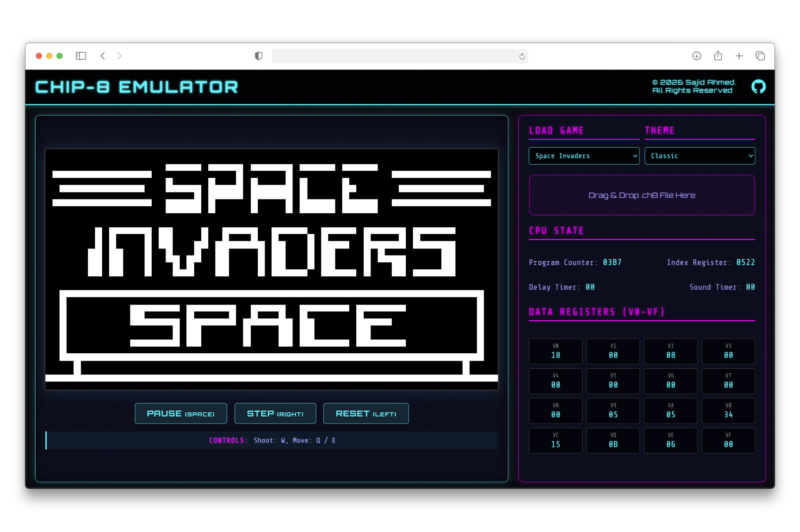

# Chip-8 Emulator | Reliving the Dawn of Gaming

**A high-performance, cycle-accurate Chip-8 interpreter running directly in your browser, powered by C and WebAssembly.**

)

---
## ⏯️ Live Demo
You don't need to install anything to play! Just visit the **[Chip-8 Emulator Website](https://chip8.sajidahmed.co.uk)**.

## The Problem
In an era of high-level abstractions and garbage-collected languages, the fundamental magic of how computers actually *think*—fetch, decode, execute—is often lost. I wanted to peel back the layers and build a system that speaks directly to memory and registers.

This project solves the challenge of bringing legacy, low-level emulation to the modern web without sacrificing performance or accuracy. It serves as a bridge between the raw power of **C** and the accessibility of **JavaScript**.

---

## Tech Stack & Justification

| Technology | Role | Justification |
| :--- | :--- | :--- |
| **C (C99)** | Core Logic | Selected for its manual memory management and zero-overhead abstraction, essential for cycle-accurate emulation. |
| **WebAssembly (Emscripten)** | Compilation Target | Allows compile-once, run-anywhere deployment on the web at near-native speeds. |
| **SDL2** | Multimedia Layer | Provides a robust, cross-platform abstraction for graphics and audio that works seamlessly with Emscripten. |
| **JavaScript (ES6)** | UI & Glue | Used to create a responsive, modern interface that standard C plotting libraries cannot match. |

---

## Key Features

- **Cycle-Accurate Emulation**: Implements all 35 standard Chip-8 opcodes with precise timing.
- **Dynamic ROM Loading**: Supports Drag & Drop functionality and loads ROMs directly into the virtual filesystem.
- **Real-time Debugging**: Inspect CPU state (Program Counter, Index Register, Stack) and general-purpose registers (`V0`-`VF`) in real-time.
- **Visual Customisation**: Switch between retro-themed colour palettes (e.g., *Blade Runner*, *Cyberpunk*) on the fly.
- **Cross-Platform Architecture**: The core logic is completely decoupled from the rendering layer, allowing for future ports to Desktop or Embedded systems.

---

## Technical Challenges & Solutions

### 1. Mastering Low-Level Memory Management
**The Challenge:** Learning to manually manage memory in C was a significant paradigm shift. Understanding how pointers, the stack, and the heap interact directly with hardware was critical not just for the emulator's correctness, but for its stability.
**The Solution:** I implemented strict bounds checking for all memory access operations and studied the Chip-8 architecture to map its 4KB memory layout precisely to a `uint8_t` array, ensuring that every opcode manipulated the emulated RAM exactly as the original hardware would, without causing buffer overflows.

### 2. The "Infinite Loop" Dilemma
**The Challenge:** Traditional emulators run inside an infinite `while(true)` loop. In a browser environment, this blocks the main thread, causing the UI to freeze and the browser to crash.
**The Solution:** I decoupled the `chip8_cycle()` function from the main loop. Using Emscripten's `emscripten_set_main_loop`, I refactored the execution flow to give control back to the browser's event loop after every frame. This ensures smooth rendering 60 times a second without locking the UI.

### 3. Bridging C and JavaScript
**The Challenge:** The core emulator lives in C/WASM memory, but the UI (Register values, ROM selection) lives in the DOM. Synchronising these two worlds efficiently is difficult.
**The Solution:** I implemented a robust Foreign Function Interface (FFI). By exporting specific C functions (e.g., `get_register_v_value`) and wrapping them with `Module.cwrap`, the JavaScript layer can "peek" into the emulator's memory state every frame. This allows for a reactive Memory Panel that updates instantly without data serialisation.

### 4. Pointer Arithmetic for Opcode Decoding
**The Challenge:** Efficiently parsing 16-bit opcodes (e.g., `0xDXYN`) into their constituent components (Draw, X register, Y register, Height) requires precise bit manipulation.
**The Solution:** I utilised bitwise masking and shifting operations (e.g., `(opcode & 0x0F00) >> 8`) to extract operands in nanoseconds. This approach avoids the overhead of higher-level parsing structs and ensures the emulator remains performant even on lower-end devices.

---

## Future Optimisations

If I had more time, I would love to implement:

- **Super Chip-8 (SCHIP) Support**: Extending the opcode set to support 128x64 resolution games.
- **Rewind Capability**: Implementing a ring buffer to store state snapshots, allowing players to "rewind" time after a mistake.
- **Mobile Friendly Controls**: A visual interface to map keyboard keys to the Chip-8 hex keypad `0-F` so mobile users without a physical keyboard can also play the games.

---

## Licensing & Usage
Copyright (c) 2026 Sajid Ahmed. **All Rights Reserved.**

This repository is a **Proprietary Portfolio Project**.

While I am a strong supporter of Open Source Software, this specific codebase represents a significant personal investment of time and effort and is therefore provided for **recruitment evaluation only**.

* **Permitted:** Viewing, forking (within GitHub only), and local execution for review.
* **Prohibited:** Modification, redistribution, commercial use, and AI/LLM training.

For the full legal terms, please see the [LICENSE](./LICENSE) file.